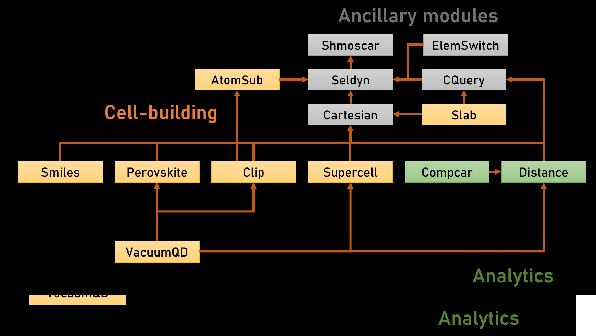

# Poshcar - VASP POSCAR text editor package

## Introduction
POSHCAR started as a cabin fever project during the first COVID lockdowns in the United States. It is a simple and lightweight text-based engine for generating and editing files in VASP format, which is one of the simplest and most compact descriptions of a crystal structurescurrently in use. The development follows an organic and modular development model where new functions are written whenever a project-specific need arises, so expect many changes as I hop from project to project.

## How to use demo file
Demo notebooks are organised into 3 parts: 
**Core modules:** Basic operations 
**Cell-building modules:** Functions that lets you generate unit cells, e.g. supercells, organic molecules, slabs 
**Analytics:** Functions involving statistical analysis of a unit cell, e.g. bonding behaviour 

The output of the demo operations can be seen in the "_ demo" folder.

## Modules
Interdependencies of modules are illustrated in the diagram below. The dependence is marked with arrows (dependent -> core)

## Dependencies
re, math, numpy, pandas, itertools, operator, copy, nglview, ase

## How to install
Just download the whole shebang and run your notebooks in the same folder as all they .py files. You should keep input or output files in a dedicated subfolder to keep things neat, but that's just my suggestion. Go nuts!

## Changelog
You can visit the changelog for a short summary of changes I made over the years. I'm a bit lazy in the documentation, though. 
**Last update:** 1 December 2023

