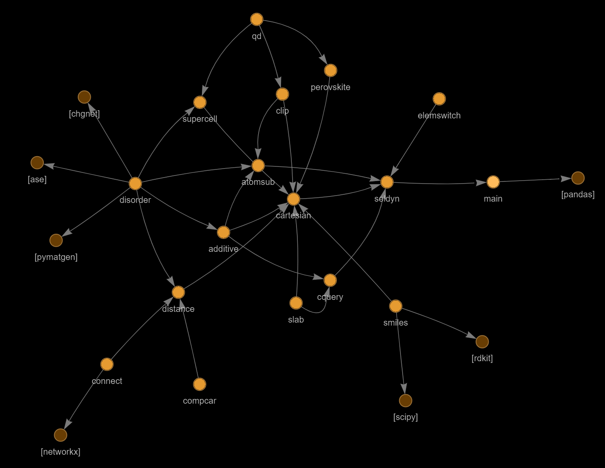

# Poshcar - VASP POSCAR text editor package 
Author: Andy Paul Chen (MSE, Nanyang Technological University)

## Introduction
POSHCAR started as a cabin fever project during the first COVID lockdowns in the United States. It is a simple and lightweight text-based engine for generating and editing files in VASP format, which is one of the simplest and most compact descriptions of a crystal structures currently in use. The development follows an organic and modular development model where new functions are written whenever a project-specific need arises, so expect many changes as I hop from project to project.

## How to use demo file
Demo notebooks are organised into 3 parts: 
**Core modules:** Basic operations 
**Cell-building modules:** Functions that lets you generate unit cells, e.g. supercells, organic molecules, slabs 
**Analytics:** Functions involving statistical analysis of a unit cell, e.g. bonding behaviour 

The output of the demo operations can be seen in the `tests/_demo/` folder.

## Modules
Interdependencies of modules are illustrated in the diagram below. The dependency relationship is marked with arrows (dependent -> core). Please use this graph for your reference if you would like to add to Poshcar!  

## Dependencies
ase, pyvis, rdkit, scipy, pymatgen, chgnet, pandas, networkx

## How to install
Download the package, `cd` to the folder where `setup.py` is, and then run the pip install (`pip install .`). 
If you would like to edit and test the code, run pip in the editable mode (`pip install -e .`).  
A demonstration can be found in `tests/_demo/test-1-core.ipynb`.

## Changelog
You can visit the changelog in `docs/changelog.txt` for a short summary of changes I made over the years. I'm a bit lazy in the documentation, though. 
**Current version:** 2.0.0 
**Last update:** 24 October 2024

